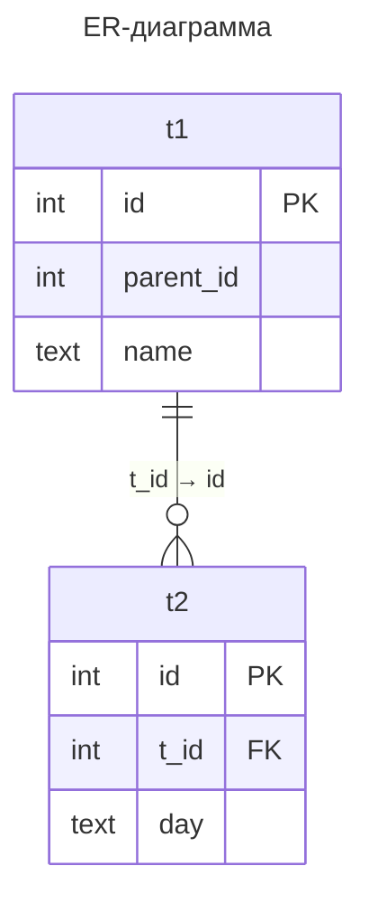

# Тестовое задание команды системной производительности для стажировки 2025: Оптимизация запросов в PostgreSQL

Анализ и оптимизация SQL-запросов в PostgreSQL с объяснением причин медленной работы и способов ускорения.

---

## Оглавление

- [I. Инициализация](#i-ициализация)
  - [1. Установка PostgreSQL 16](#1-установка-postgresql-16)
  - [2. Генерация БД с помощью предложенного скрипта](#2-генерация-бд-с-помощью-предложенного-скрипта)
- [II. Решение](#ii-решение)
  - [1. Задача 1](#1-задача-1)
  - [2. Задача 2](#2-задача-2)
  - [3. Задача 3](#3-задача-3)
  - [4. Задача 4](#4-задача-4)
  - [5. Задача 5](#5-задача-5)

---

## I. Инициализация

### 1. Установка PostgreSQL 16

Я установил новейшую версию PostgreSQL 16.8 с классическим портом 5432 и пользователем postgres.

### 2. Генерация БД с помощью предложенного скрипта

Я создал скрипт из предложенного в задании, сохранил комментарии для основных блоков (отключение параллельных запросов; генерация базы t1 из 10^7 записей; генерация базы t2 из 5*10^6 записей) и назвал [gen_dbs.sql](gen_dbs.sql). 
В терминале psql я его запустил. Проверка выполнения ниже:

**Вывод:**

```sql
postgres-# \dti+
                                       Список отношений
 Схема  | Имя |   Тип   | Владелец | Таблица |  Хранение  | Метод доступа | Размер | Описание
--------+-----+---------+----------+---------+------------+---------------+--------+----------
 public | t1  | таблица | postgres |         | постоянное | heap          | 652 MB |
 public | t2  | таблица | postgres |         | постоянное | heap          | 249 MB |
(2 строки)
```



---

## II. Решение:

### 1. Задача 1

Ускорить простой запроc, добиться времени выполнения < 10ms

**Исходный запрос:**

``` sql
select name from t1 where id = 50000;
```
Получим план этого запроса:

``` sql
EXPLAIN (ANALYZE, BUFFERS)
SELECT name FROM t1 WHERE id = 50000;
```

Вывод:

```sql
                    QUERY PLAN
 Seq Scan on t1  (cost=0.00..208379.92 rows=1 width=30) (actual time=13.877..2941.615 rows=1 loops=1)
   Filter: (id = 50000)
   Rows Removed by Filter: 9999999
   Buffers: shared hit=2112 read=81280
 Planning:
   Buffers: shared hit=5 dirtied=1
 Planning Time: 8.826 ms
 Execution Time: 2943.684 ms
(8 строк)
```

Происходит последовательный перебор значений до нужного, из-за чего время выполнения запроса составляет почти 3 секунды. Выходит так из-за расположения необходимого значения в конце таблицы (наихудший вариант по скорости выполнения; сложность алгоритма — O(n))

**Оптимизация:**

Заметим, что таблица t1 создавалась с помощью генератора числовых последовательностей. Соответственно, можно проиндексировать записи, перезагрузить конфигурацию и сделать повторный запрос:

```sql
CREATE INDEX idx_t1_id ON t1(id);
SELECT pg_reload_conf();
EXPLAIN (ANALYZE, BUFFERS)
SELECT name FROM t1 WHERE id = 50000;
```

Вывод:

```sql
                    QUERY PLAN
Index Scan using idx_t1_id on t1  (cost=0.43..3.45 rows=1 width=30) (actual time=0.524..0.528 rows=1 loops=1)
   Index Cond: (id = 50000)
   Buffers: shared read=4
 Planning:
   Buffers: shared hit=18 read=1
 Planning Time: 4.532 ms
 Execution Time: 0.982 ms
(7 строк)
```
Как видно, время выполнения запроса меньше 10 мс при индексном поиске (сложность алгоритмя — O(log(n)))

---

### 2. Задача 2

Ускорить запрос "max + left join", добиться времени выполнения < 10ms

Перед началом применим команду для очищения индексов:

```sql
DROP INDEX idx_t1_id CASCADE;
```

**Исходный запрос:**

``` sql
select max(t2.day) from t2 left join t1 on t2.t_id = t1.id and t1.name like 'a%';
```
Получим план этого запроса:

``` sql
explain (ANALYZE, BUFFERS)
select max(t2.day) from t2 left join t1 on t2.t_id = t1.id and t1.name like 'a%';
```

Вывод:

```sql
                            QUERY PLAN
 Aggregate  (cost=332121.58..332121.59 rows=1 width=32) (actual time=9880.463..9880.465 rows=1 loops=1)
   Buffers: shared hit=4513 read=110751
   ->  Hash Left Join  (cost=215967.76..319621.36 rows=5000090 width=9) (actual time=3367.583..6890.569 rows=5000000 loops=1)
         Hash Cond: (t2.t_id = t1.id)
         Buffers: shared hit=4513 read=110751
         ->  Seq Scan on t2  (cost=0.00..81872.90 rows=5000090 width=13) (actual time=1.099..920.136 rows=5000000 loops=1)
               Buffers: shared hit=2176 read=29696
         ->  Hash  (cost=208392.00..208392.00 rows=606061 width=4) (actual time=3362.394..3362.395 rows=624766 loops=1)
               Buckets: 1048576  Batches: 1  Memory Usage: 30157kB
               Buffers: shared hit=2337 read=81055
               ->  Seq Scan on t1  (cost=0.00..208392.00 rows=606061 width=4) (actual time=0.138..3067.305 rows=624766 loops=1)
                     Filter: (name ~~ 'a%'::text)
                     Rows Removed by Filter: 9375234
                     Buffers: shared hit=2337 read=81055
 Planning:
   Buffers: shared hit=5 dirtied=1
 Planning Time: 14.855 ms
 Execution Time: 9884.775 ms
(18 строк)
```

---

### 3. Задача 3

Ускорить запрос "anti-join", добиться времени выполнения < 10sec

**Исходный запрос:**

``` sql
select day from t2 where t_id not in ( select t1.id from t1 );
```

---

### 4. Задача 4

Ускорить запрос "semi-join", добиться времени выполнения < 10sec

**Исходный запрос:**

``` sql
select day from t2 where t_id in ( select t1.id from t1 where t2.t_id = t1.id) and day > to_char(date_trunc('day',now()- '1 months'::interval),'yyyymmdd');
```

---

### 5. Задача 5